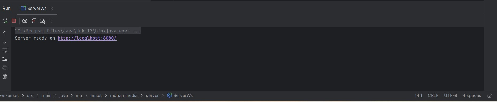

# webservice-soap-wsdl
<h3>Démarrer le serveur jx-ws sur le port 8080</h3>

<h3>Voir le schéma XML à partir du WSDL</h3>

<h3>Tester le web service via SoapUI</h3>

<h3>Générer un STUB au niveau client et tester le web service à partir du client-ws.</h3>

<h3>Schéma résumant l'architecture d'un web service basé sur SOAP</h3>
